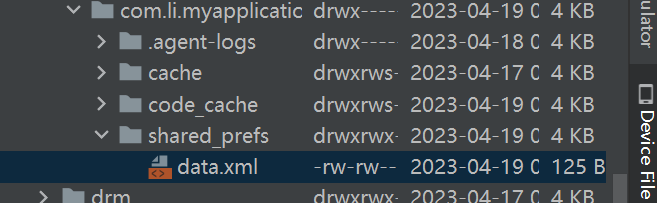
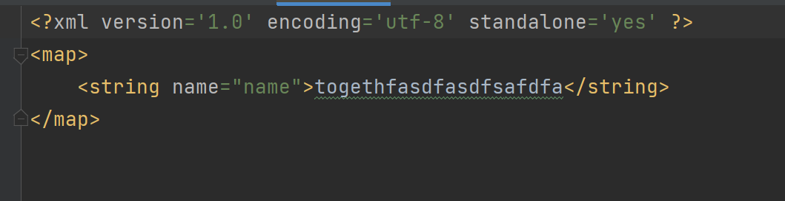

# Android_learning
record my learning progress in Android, just some basic using.

## some knowledge

### Activity启动模式

    知识点写在了manifest中了

### Fragment

1. Fragment有自己的生命周期
2. Fragment依赖于Activity
3. Fragment和Activity有相互获取的function
4. Fragment和Activity是多对多的关系

### Storage

Android存储

1. 内部存储
   1. share_prefs
   2. databases
   3. files
   4. cache
2. 外部存储
   1. 公有目录
   2. 私有目录

#### SharedPreferences

1. 存储文件目录 /data/data/<applicationId>/shared_prefs
   1. 这个文件要去手机里找，或者模拟器的话去Device Manager里面找到文件存储，然后找这个路径，是可以找到这个存储文件的
   2. 
   3. 

#### File内部存储

存储位置： /data/data/<applicationId>/files
